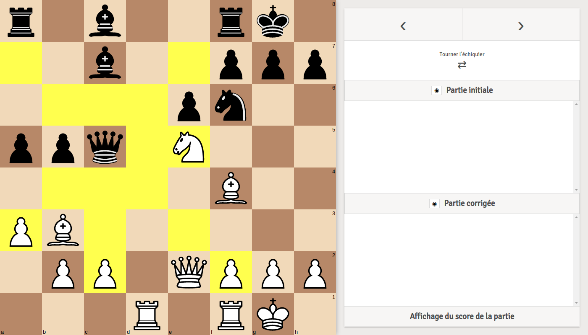
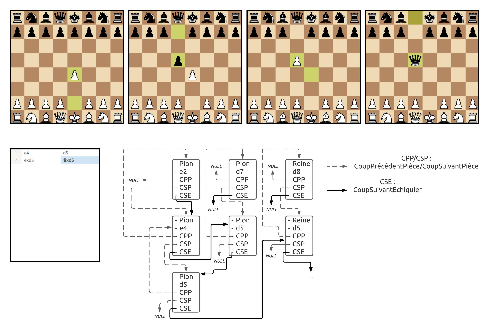
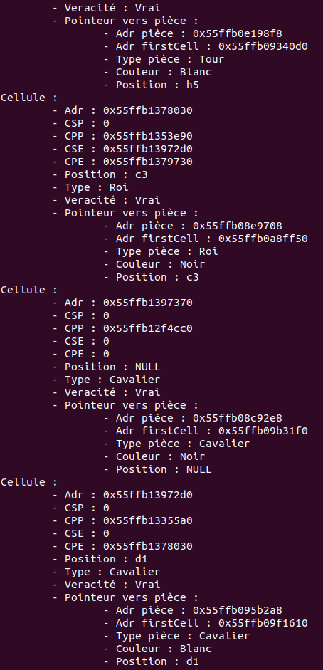

# Compléteur de notation d'Échecs

## Screenshots

  
   
   

## Description
L'objectif du projet est de réaliser un compléteur de notation d'Échecs à savoir un programme capable de lire une partie d'échecs au format PGN et de détecter s'il y a des erreurs ou non. Dans le cas où il y aurait des erreurs, le programme doit pouvoir reconstruire la partie sans erreur à l'aide de déductions logiques.
